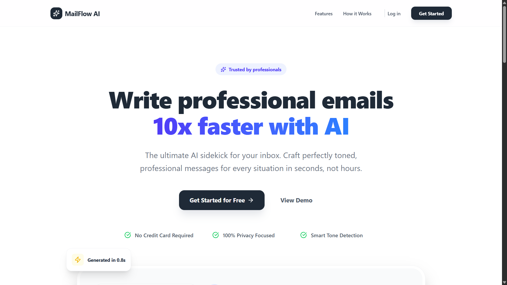
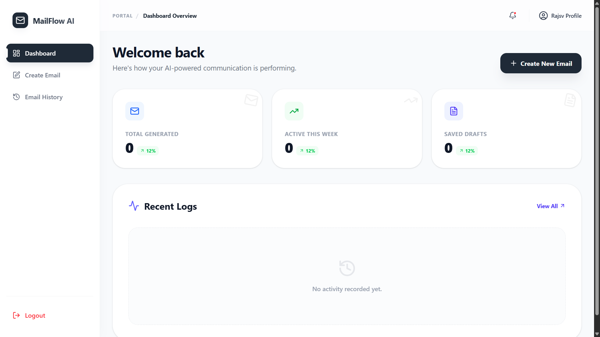

<div align="center">
  <h1>✉️ MailFlow AI</h1>
  <p><strong>Enterprise-Grade AI-Powered Email Generation Platform</strong></p>

  <!-- Badges -->
  <p>
    
    
    
    
    
  </p>
  <p>
    <a href="https://mailflow-ai-phi.vercel.app">Live Frontend</a> •
    <a href="https://mailflow-backend-gx94.onrender.com">Backend API</a>
  </p>
</div>

<br />

## 📋 Table of Contents
- [Project Overview](#-project-overview)
- [Architecture](#-architecture-overview)
- [Features](#-features)
- [Application Preview](#-application-preview)
- [Tech Stack](#-tech-stack)
- [Folder Structure](#-folder-structure)
- [Getting Started](#-getting-started)
  - [Prerequisites](#prerequisites)
  - [Environment Variables](#environment-variables)
  - [Installation & Setup](#installation--setup)
- [API Reference](#-api-reference)
- [Deployment](#-deployment)
- [Troubleshooting](#-troubleshooting)
- [Future Improvements](#-future-improvements)
- [Contributing](#-contributing)
- [License](#-license)

---

## 📖 Project Overview

MailFlow AI is a robust, full-stack application designed to streamline email composition through advanced Artificial Intelligence. Leveraging the power of OpenAI and Groq APIs, this platform empowers users to generate professional, context-aware emails in real-time. Built on the MERN stack (MongoDB, Express.js, React, Node.js) with a focus on scalable architecture and secure JWT-based authentication.

---

## 🏗 Architecture Overview

MailFlow AI implements a decoupled client-server architecture:

- **Client (Frontend):** A responsive React single-page application (SPA) built with Vite and Tailwind CSS, deployed on Vercel. It communicates with the backend via RESTful API calls.
- **Server (Backend):** A Node.js/Express REST API deployed on Render. It handles authentication, interfaces with the MongoDB database, orchestrates AI generation requests to external LLM providers (OpenAI/Groq), and dispatches emails via Nodemailer.
- **Database:** MongoDB Atlas provides a managed, scalable cloud database solution for user data and application state.


---

## ✨ Features

- **🔐 Secure Authentication:** JWT-based user registration and login system with secure password hashing.
- **🤖 AI Content Generation:** Dynamic email drafting powered by OpenAI and Groq language models.
- **⚡ Real-time Workflow:** Seamless generation, editing, and previewing of email content.
- **📨 Integrated Mailing:** Direct email dispatch capabilities utilizing Nodemailer and Gmail SMTP.
- **🛡️ Protected Routing:** Secured backend API endpoints ensuring data privacy and authorized access only.
- **📱 Responsive UI:** Modern, mobile-first frontend interface designed with Tailwind CSS.

---

## 📸 Application Preview

### Landing Page


<br />

### Dashboard


---

## 💻 Tech Stack

### Frontend
- **Framework:** React 18
- **Tooling:** Vite
- **Styling:** Tailwind CSS
- **Routing:** React Router DOM

### Backend
- **Runtime:** Node.js
- **Framework:** Express.js
- **Database:** MongoDB Atlas (Mongoose ODM)
- **Authentication:** JSON Web Tokens (JWT) & bcrypt
- **Email Service:** Nodemailer

### Integrations
- **AI Providers:** OpenAI API, Groq API

---

## 📁 Folder Structure

```text
AI-Email-Composer-FullStack/
├── client/                     # Frontend React application
│   ├── public/                 # Static assets
│   ├── src/
│   │   ├── components/         # Reusable UI components
│   │   ├── pages/              # Application views (Home, Login, etc.)
│   │   ├── utils/              # Helper functions and API clients
│   │   ├── App.jsx             # Root component and routing
│   │   └── main.jsx            # React entry point
│   ├── package.json
│   ├── tailwind.config.js      # Tailwind CSS configuration
│   └── vite.config.js          # Vite build configuration
│
└── server/                     # Backend Express application
    ├── config/                 # Database and environment configurations
    ├── controllers/            # Request handlers (auth, email generation)
    ├── middleware/             # Custom Express middleware (auth guard)
    ├── models/                 # Mongoose database schemas
    ├── routes/                 # API route definitions
    ├── .env                    # Backend environment variables
    ├── package.json
    └── server.js               # Application entry point
```

---

## 🚀 Getting Started

Follow these instructions to set up the project locally for development and testing.

### Prerequisites

- [Node.js](https://nodejs.org/) (v18 or higher recommended)
- [npm](https://www.npmjs.com/) or [yarn](https://yarnpkg.com/)
- [MongoDB Atlas](https://www.mongodb.com/atlas) account (or local MongoDB instance)
- API Keys for [OpenAI](https://platform.openai.com/) and/or [Groq](https://console.groq.com/)
- App Password for Gmail SMTP (if using email sending feature)

### Environment Variables

You will need to create `.env` files in both the `client` and `server` directories.

**`server/.env`**
```env
PORT=5000
MONGODB_URI=your_mongodb_connection_string
JWT_SECRET=your_super_secret_jwt_key
OPENAI_API_KEY=your_openai_api_key
GROQ_API_KEY=your_groq_api_key
EMAIL_USER=your_gmail_address@gmail.com
EMAIL_PASS=your_gmail_app_password
CLIENT_URL=http://localhost:5173
```

**`client/.env`**
```env
VITE_API_URL=http://localhost:5000
```

### Installation & Setup

1. **Clone the repository**
   ```bash
   git clone https://github.com/yourusername/MailFlow-AI.git
   cd MailFlow-AI
   ```

2. **Install Backend Dependencies**
   ```bash
   cd server
   npm install
   ```

3. **Install Frontend Dependencies**
   ```bash
   cd ../client
   npm install
   ```

4. **Run the Application locally**

   You will need two terminal windows.

   **Terminal 1 (Backend):**
   ```bash
   cd server
   npm run dev
   # Server should start on http://localhost:5000
   ```

   **Terminal 2 (Frontend):**
   ```bash
   cd client
   npm run dev
   # Frontend should start on http://localhost:5173
   ```

---

## 🛣️ API Reference

### Authentication
- `POST /api/auth/register` - Register a new user
- `POST /api/auth/login` - Authenticate user and receive JWT

### Email Generation & Management
- `POST /api/email/generate` - Generate email content using AI (Requires Bearer Token)
- `POST /api/email/send` - Dispatch an email via SMTP (Requires Bearer Token)

*(Note: API routes are protected by JWT middleware ensuring only authenticated requests are processed.)*

---

## ☁️ Deployment

The project is configured for cloud deployment using a decoupled architecture.

### Frontend (Vercel)
The React application is optimized for deployment on Vercel. Ensure the `VITE_API_URL` environment variable in Vercel is set to your production backend URL.
- **Live URL:** [https://mailflow-ai-phi.vercel.app](https://mailflow-ai-phi.vercel.app)

### Backend (Render)
The Node.js/Express server is hosted on Render as a Web Service.
- Ensure all environment variables from `server/.env` are added to the Render dashboard.
- Set the `CLIENT_URL` environment variable to your Vercel frontend domain to properly configure CORS.
- **Live URL:** [https://mailflow-backend-gx94.onrender.com](https://mailflow-backend-gx94.onrender.com)

---

## 🔧 Troubleshooting

### CORS Issues in Production
If the frontend cannot communicate with the backend, verify the CORS configuration in `server/server.js`.
Ensure the `CLIENT_URL` environment variable on Render exactly matches your Vercel URL (without trailing slashes).
```javascript
app.use(cors({
  origin: process.env.CLIENT_URL,
  credentials: true
}));
```

### MongoDB Atlas Connection Failures
- **Network Access:** Ensure your IP address (or `0.0.0.0/0` for production) is whitelisted in the MongoDB Atlas Network Access settings.
- **Credentials:** Double-check your `MONGODB_URI` string. Ensure the username and password do not contain special characters that require URL encoding.

---

## 🔮 Future Improvements

- [ ] Implement OAuth 2.0 (Google/GitHub Sign-in)
- [ ] Add email templates and saving drafts to the database
- [ ] Integrate a rich text editor for post-generation refinements
- [ ] Add rate limiting to AI generation endpoints
- [ ] Implement comprehensive unit and integration testing

---

## 🤝 Contributing

Contributions are welcome! Please follow these steps:
1. Fork the project
2. Create your feature branch (`git checkout -b feature/AmazingFeature`)
3. Commit your changes (`git commit -m 'Add some AmazingFeature'`)
4. Push to the branch (`git push origin feature/AmazingFeature`)
5. Open a Pull Request

---

## 📄 License

Distributed under the MIT License. See `LICENSE` for more information.

<div align="center">
  <p>Built with ❤️ for better email workflows.</p>
</div>
